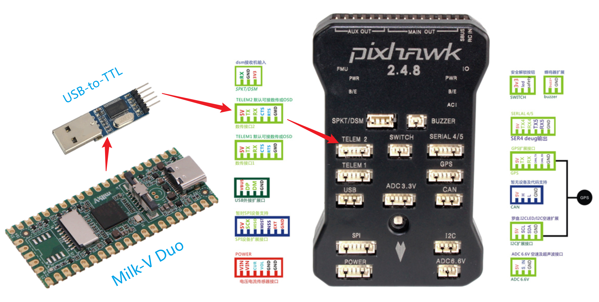

# Milk-V Duo 控制无人机

## 概述

基于国产RISC-V架构处理器的救灾用照明无人机，主控开发板选择深圳市群芯闪耀科技有限公司的Milk-V Duo开发板

要求至少实现以下要求:

- 稳定在某高度，滞空10s（允许存在抖动）
- 需要能向下照明一定范围的地面（仅作为示意

## 硬件选型

自行设计一套无人机的飞行控制系统需要耗费大量的时间和精力，建议选用市面上成熟的飞控方案，一方面可以降低成本，另一方面可靠性也有保障，以下是一些无人机选型需要考虑的因素

- 飞行器的类型和规模: 不同类型和规模的无人机需要不同种类的飞控。例如，小型多旋翼通常使用较为简单的飞控，如CC3D或Naze32；中大型多旋翼则需要使用更为复杂的飞控，如Ardupilot或Pixhawk。
- 性能要求：如果只是用于简单的遥控飞行，可以选则KK2或Naze32这种小型的飞控。如果需要实现高级功能，如自主导航，避障等，则需要选择功能更强大的飞控，如Ardupilot或Pixhawk。
- 使用环境：选择飞控时还需要考虑使用环境，如天气条件、温度、海拔等，一些专业的飞控，如Pixhawk，具有更强的抗干扰能力和适应性，适合在恶劣环境下使用。

综合考虑， 推荐使用`Pixhawk`做为飞控，比如经典的Pixhawk 2.4.8版本

Pixhawk 2.4.8是一款完全开源的飞控硬件，具有多种传感器和接口，包括加速度计、陀螺仪、磁力计、气压计、GPS、串口、CAN总线等，支持多种配置和应用场景，如多旋翼、固定翼和地面车辆等。

确定好飞控硬件后，可以选择一些基于Pixhawk飞控的一些四轴飞行器套件，这里不做展开。

> 说明：Pixhawk虽然固件开源，但它的主要优势在于飞行控制这一块，对于应用的设计及飞行场景的优化，搭配基于Linux系统的Duo开发板来使用，更容易实现一些应用功能。比如可以将Duo通过WIFI连接到网络，地面站的PC或其他连到相同网络的设备，可以更好的获取无人机的状态或者对无人机进行控制。

用`Duo`来控制Pixhawk，可以通过Uart口，连接到Pixhawk的TELEM 2上, 可根据实际情况选择USB转TTL或者使用Duo上的原生Uart口

## 软件支持

与Pixhawk硬件配合使用的，最成熟的通讯协议是MAVLink协议。

MAVLink（Micro Air Vehicle Link）是一种轻量级、异构的通信协议，用于在无人机、机器人和地面站之间传输数据和命令。MAVLink协议最初是由Pixhawk团队开发的，目前已经成为无人机领域最流行的通信协议之一。

以下是MAVLink协议的一些特点：

1. 轻量级：MAVLink协议采用了紧凑的二进制数据格式，可以在带宽有限的网络环境下传输数据和命令。
2. 可扩展性：MAVLink协议采用了基于XML的消息定义语言，可以方便地添加新的消息类型和参数，以适应不同的应用场景。
3. 异构性：MAVLink协议支持多种物理层和传输协议，如串口、CAN总线、UDP、TCP等，可以在不同的硬件和软件平台之间进行通信。
4. 开源免费：MAVLink协议是完全开源的，任何人都可以免费使用、修改和分发，也可以获得开源社区的支持和帮助。

MAVLink协议定义了多种消息类型，包括状态、控制、传感器、遥测、命令等，可以传输无人机的状态信息、传感器数据、控制指令、遥测数据等。MAVLink协议还提供了一些常用的命令和消息，如心跳、状态、位置、姿态、电池电量、航向等，可以方便地实现无人机的控制和监测。

 

MAVLink协议支持C/Python/Java/Swift等多种语言实现，鉴于Duo内存有限(64M)，建议使用C版本的MAVLink代码开发。

## 软件开发指引

MAVLink协议的C语言版本参考代码: [Official reference C/C++ library for the v2 protocol](https://github.com/mavlink/c_library_v2)

首先需要将上述仓库中的MAVLink代码编译成能在Duo上执行的RISC-V架构的库，有如下两种方法

1. 在Duo的[duo-buildroot-sdk](https://github.com/milkv-duo/duo-buildroot-sdk)仓库中，创建新的package，在buildroot环境中编译生成MAVLink库，该方法适合熟悉buildroot的用户
2. 参考Duo的[duo-examples](https://github.com/milkv-duo/duo-examples)仓库，基于 MAVLink的代码，编写Makefile文件，生成MAVLink库，适合对Makefile熟悉的用户

其次，需要编写应用程序，调用MAVLink库，根据自己要实现的功能，与飞控Pixhawk通讯来控制无人机。

MAVLink协议的Uart接口调用，可以参考如下代码
[Simple MAVLink to UART interface example for Unix systems](https://github.com/mavlink/c_uart_interface_example)

## 参考文献

- [Pixhawk2.4.8接线图](http://pix.1yuav.com/)
- [MAVLink Developer Guide](https://mavlink.io/en/)
